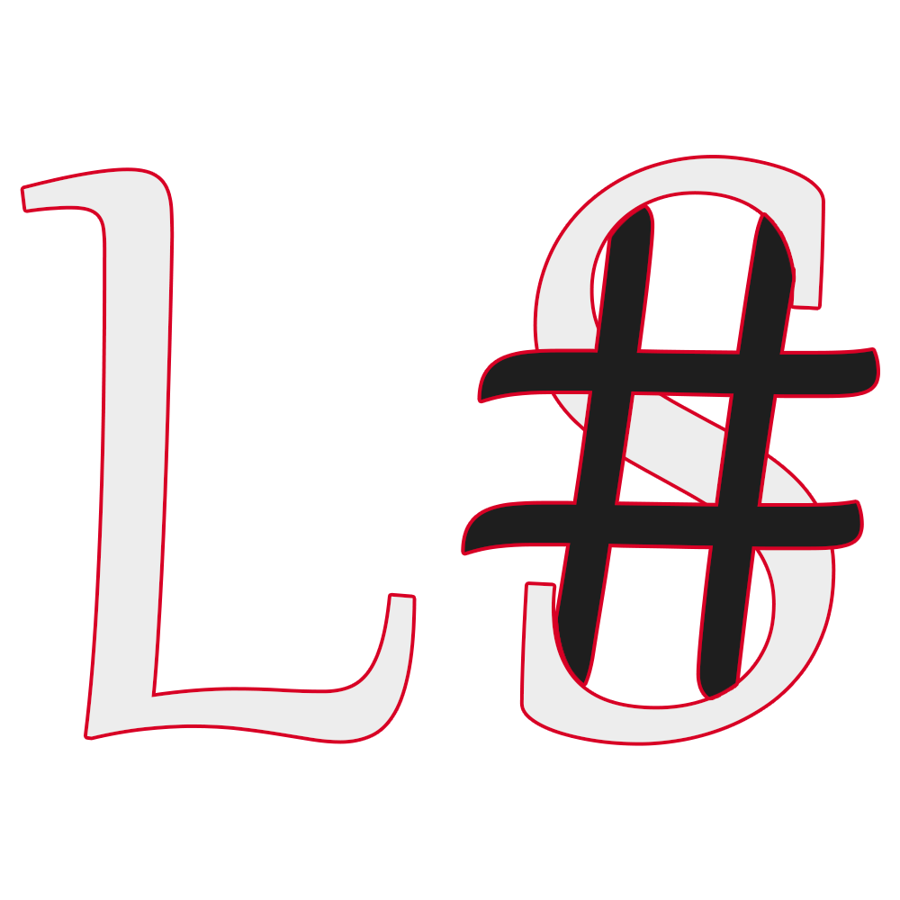

# Hi there! 👋

My name is Iliya and I'm a Iran based programmer with a passion for coding.

## About Me

- 🌱 I'm currently 16 years old.
- 💻 I love programming and have a wide range of skills in Python, C#, JavaScript, CSS, HTML, and SQL Server.
- ✨ I enjoy developing various projects and exploring new technologies.
- 👯 I'm always open to collaboration and learning new things.

## My Projects

Here are just a few examples of my projects:

## Open Bullet Pro

- [App](https://github.com/Iliya4lx/Open-Bullet-Pro): The Cracking App
- [Hub](https://github.com/Iliya4lx/Open-Bullet-Pro-Hub): Shup,Publish Config & Sell Config

- [Tools](https://github.com/Iliya4lx/Open-Bullet-Pro-Tools): Create A Tool and Add to App
- [Plugins](https://github.com/Iliya4lx/Open-Bullet-Pro-Plugins): Create A Tool and Add to App

- [Plugins](https://github.com/Iliya4lx/Open-Bullet-Pro-Document): Document

## Loli Sharp Language (L#)

- [Compiler](https://github.com/Iliya4lx/Loli-Sharp-Compiler): Compiler
- [Document](https://github.com/Iliya4lx/Loli-Sharp-Document): Document

## Checkers

Empty.

Feel free to explore my repositories to discover more of my projects!

### Darkness programmer!
